# 📧 EmailMaster CLI

<div align="center">
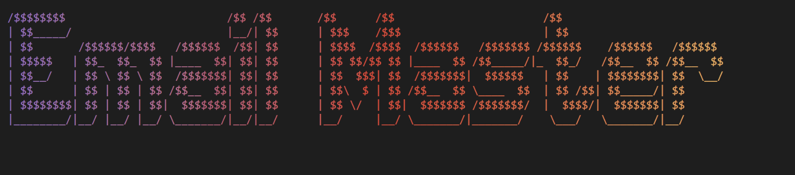

<br/>


</div>

## 🤖 AI-Powered Gmail Management Tool

_Transform your inbox into an intelligent, organized workspace with cutting-edge AI technology_

[✨ Features](#-features) • [📸 Screenshots](#-screenshots) • [🎥 Videos](#-videos) • [🚀 Quick Start](#-quick-start) • [📄 License](LICENSE.md) • [⭐ Star this repo](#)

---

## 🎯 Project Overview

EmailMaster CLI is a next-generation command-line interface that revolutionizes Gmail management through AI integration. Built with modern Node.js technologies and powered by Google's Gemini AI, it transforms the traditional email workflow into an intelligent, automated experience.

**Why EmailMaster CLI?**

- 🧠 **AI-First Design**
- ⚡ **Lightning Fast**
- 🎨 **Beautiful Interface**
- 🔧 **Developer Friendly**
- 🚀 **Productivity Focused**
- 📎 **Attachment Management**

---

## ✨ Features

<table>
<tr>
<td width="50%">

### 📥 Smart Email Management

- Intelligent Fetching
- AI-Powered Analysis
- Batch Processing
- Multi-Account Support
- Persistent Identifiers

### 🧠 AI-Powered Intelligence

- Sentiment Detection
- Priority Classification
- Suggested Responses
- Natural Language Search
- Smart Summarization
- Automated Responses

</td>
<td width="50%">

### 🎯 Productivity Tools

- Inbox Zero Automation
- Calendar Event Extraction
- Unsubscribe Management
- Advanced Search

### 📎 Attachment Vault

- Smart Downloads
- Auto Organization
- Incremental Sync
- Statistics Dashboard

### 🎨 Modern Interface

- Gradients & Styling
- Tables with Progress
- Responsive Terminal Design

</td>
</tr>
</table>

---

## 📸 Screenshots

<div align="center">

### 🎨 Beautiful CLI Interface (1-9)

<table>
<tr>
<td>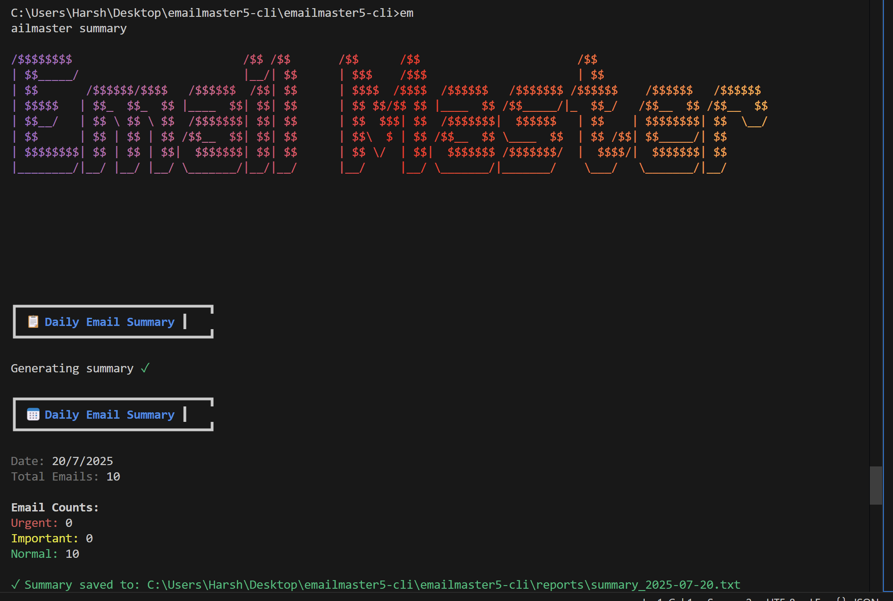</td>
<td>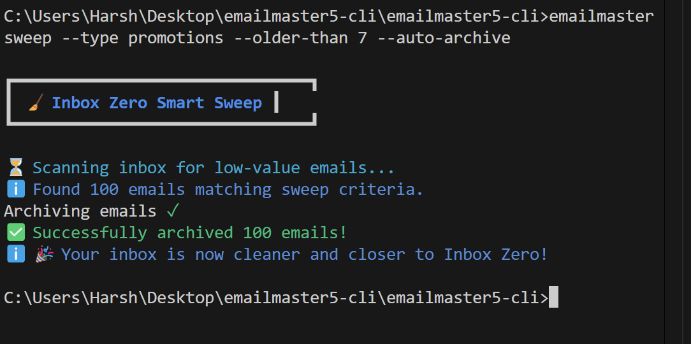</td>
<td>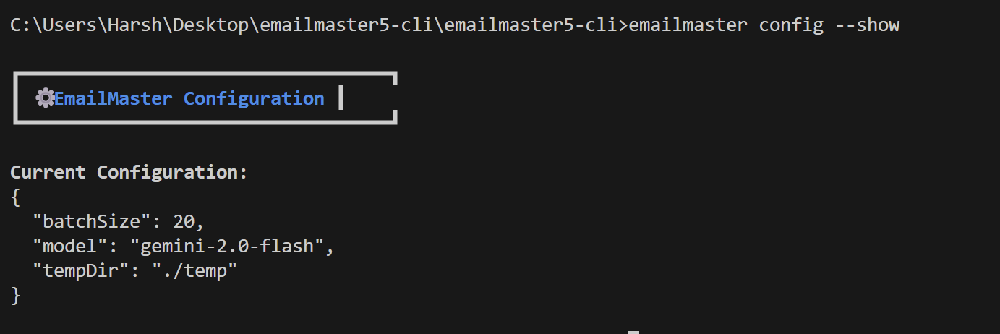</td>
</tr>
<tr>
<td>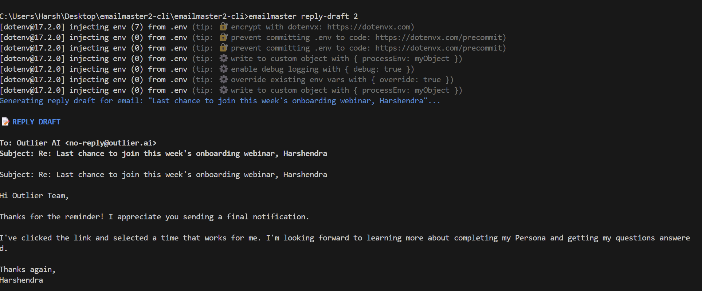</td>
<td></td>
<td>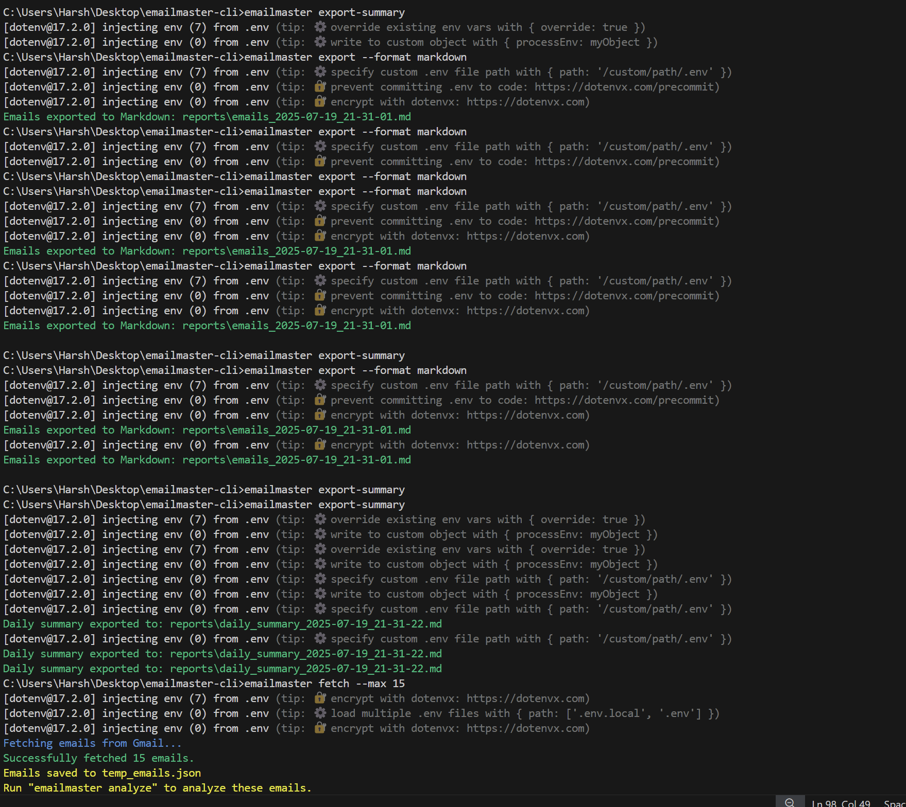</td>
</tr>
<tr>
<td>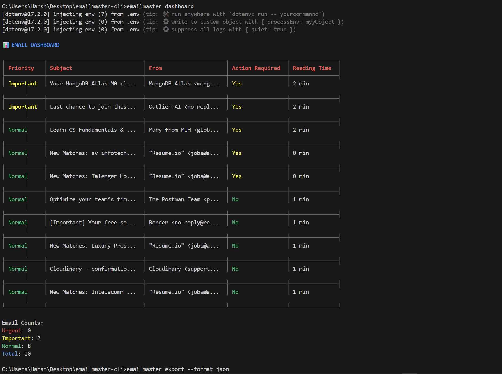</td>
<td>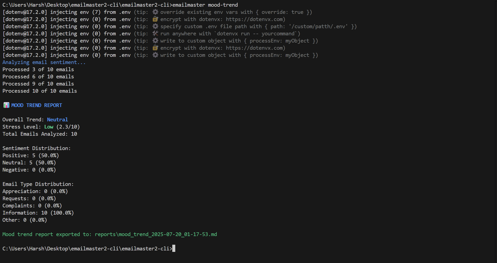</td>
<td>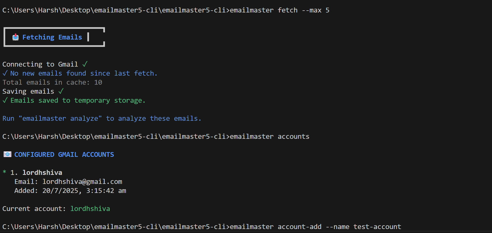</td>
</tr>
</table>

---

### 🎨 Advanced Features (10-18)

<table>
<tr>
<td>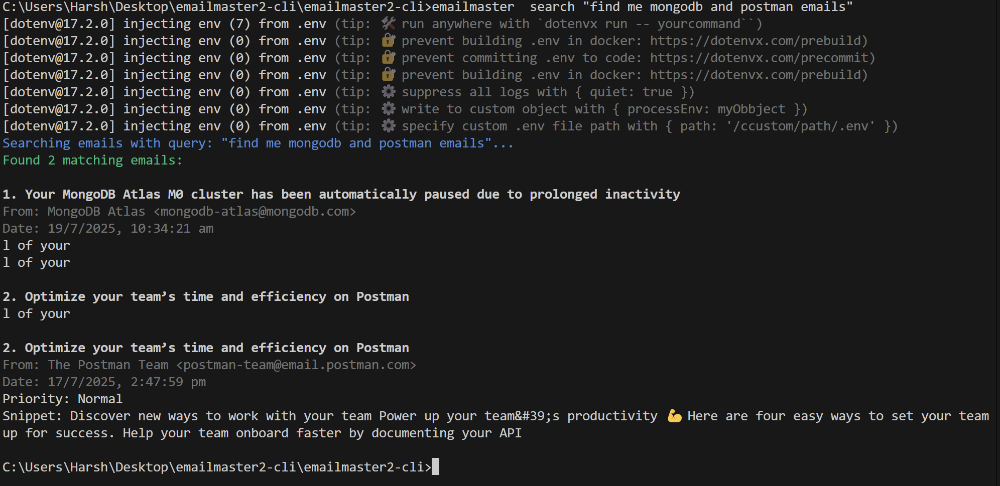</td>
<td>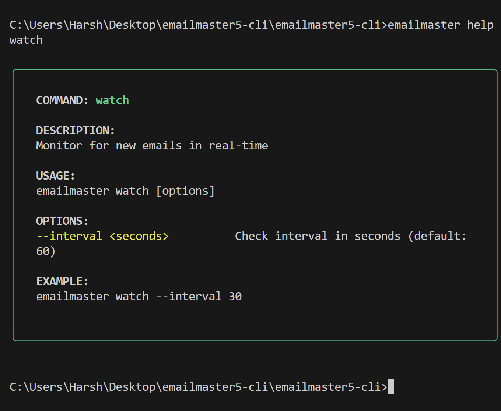</td>
<td>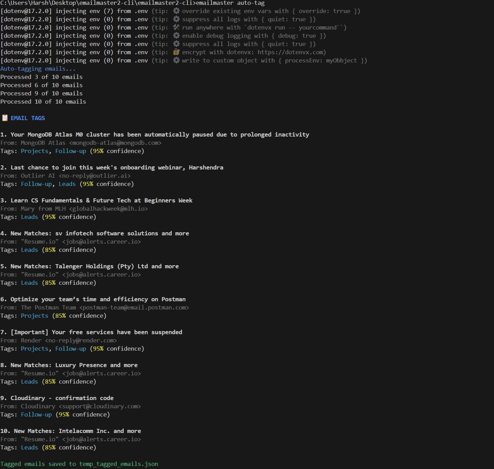</td>
</tr>
<tr>
<td>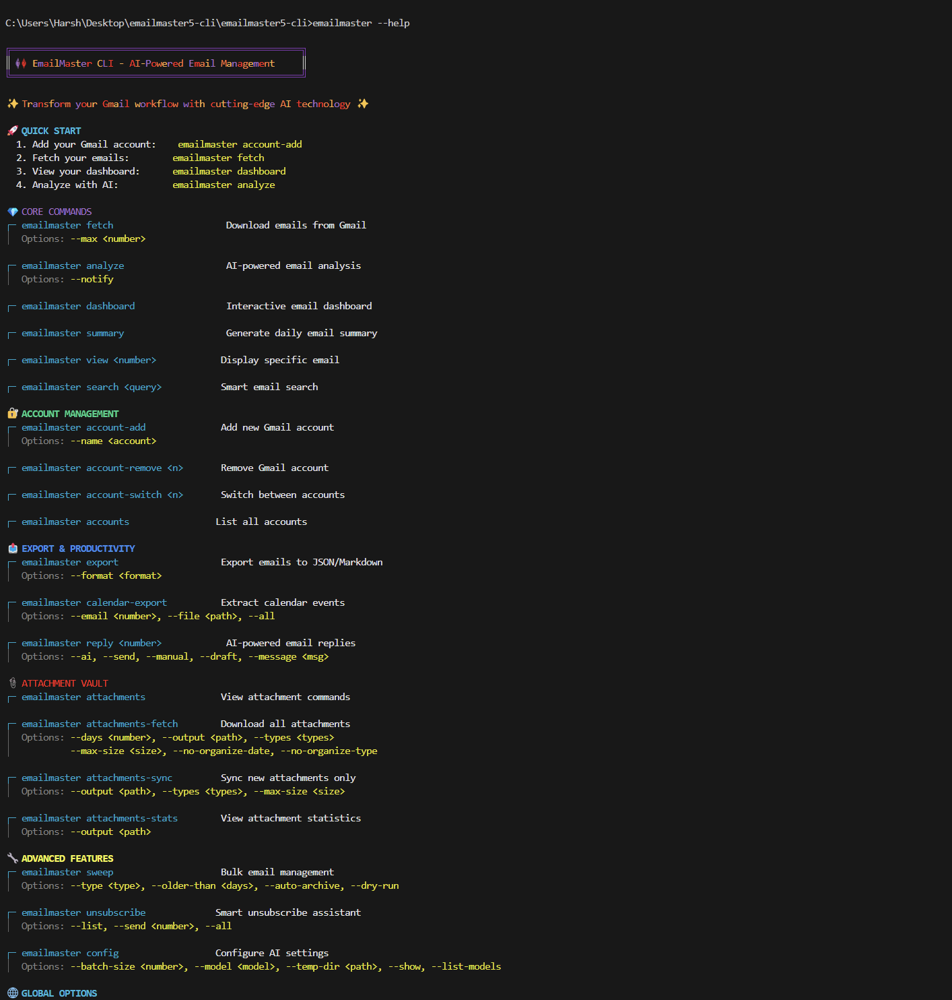</td>
<td>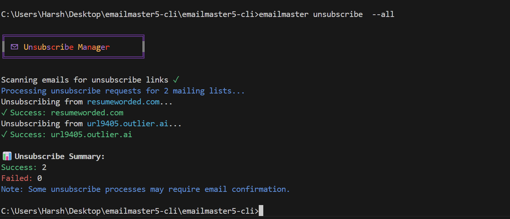</td>
<td>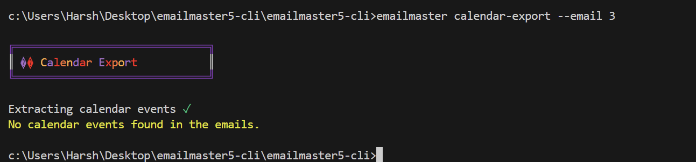</td>
</tr>
<tr>
<td>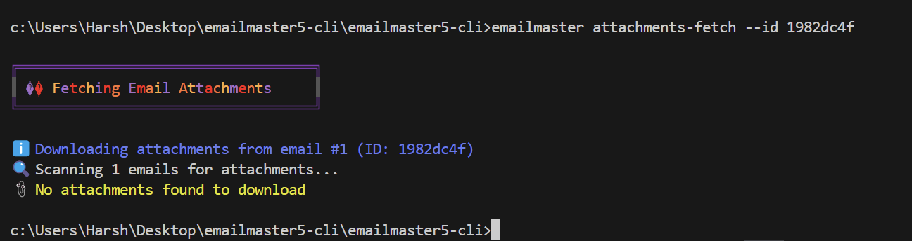</td>
<td>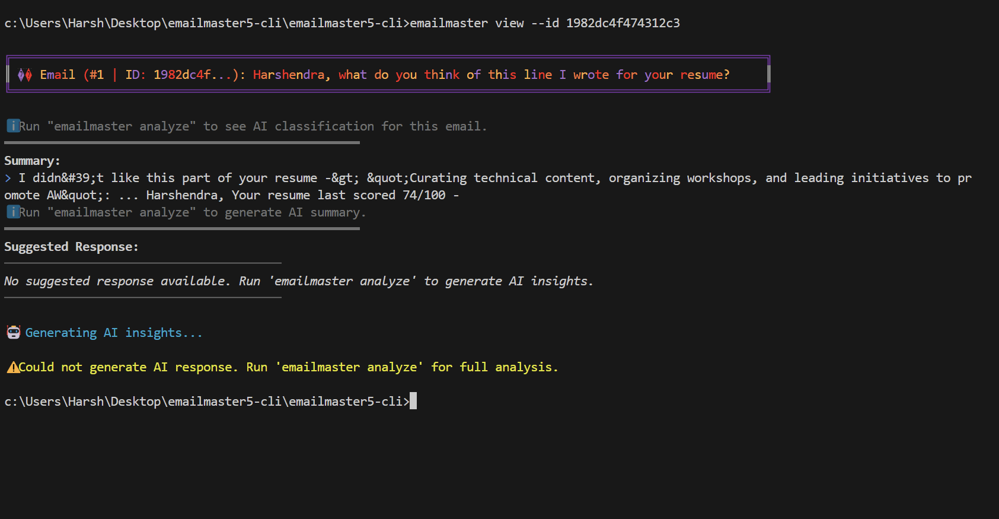</td>
<td>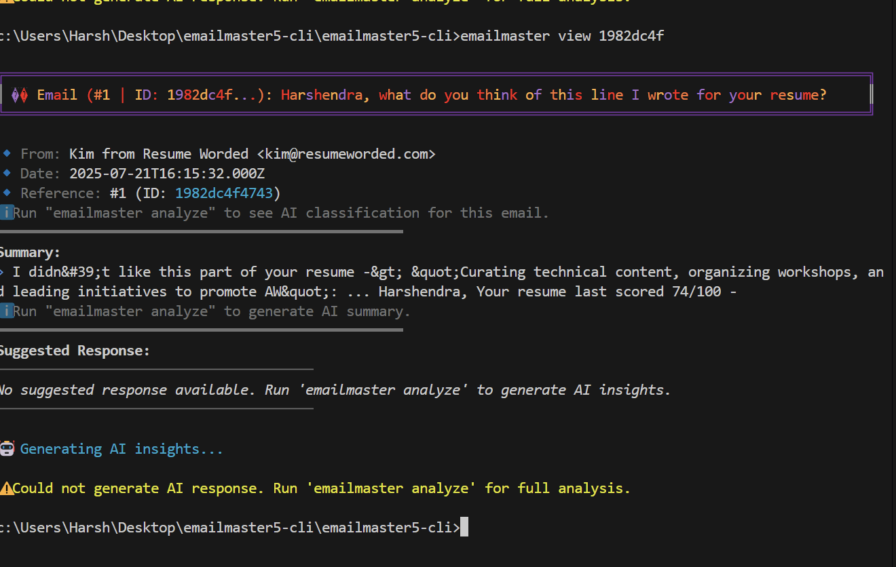</td>
</tr>
</table>

</div>

---

## 🎥 Videos

<div align="center">

### 🎬 See My Development Video

[](https://youtu.be/MUkL4qvLiYw)

</div>

---

## 📋 Command Reference

| Command                                    | Description                                   | Common Options                                                                                                           |
| ------------------------------------------ | --------------------------------------------- | ------------------------------------------------------------------------------------------------------------------------ |
| **🔐 Authentication & Account Management** |                                               |                                                                                                                          |
| `emailmaster accounts`                     | List all configured accounts                  |                                                                                                                          |
| `emailmaster account-add`                  | Add Gmail account with OAuth2 authentication  | `--name <account>`                                                                                                       |
| `emailmaster account-remove`               | Remove a configured account                   | `<name>`                                                                                                                 |
| `emailmaster account-switch`               | Switch between configured accounts            | `<name>`                                                                                                                 |
| **📧 Core Email Operations**               |                                               |                                                                                                                          |
| `emailmaster fetch`                        | Retrieve emails from Gmail with smart caching | `-m, --max <number>`                                                                                                     |
| `emailmaster list`                         | Show all emails with indices                  | `--limit <number>`                                                                                                       |
| `emailmaster view [identifier]`            | Display email by number                       | `--id <uniqueId>`                                                                                                        |
| `emailmaster analyze`                      | AI-powered email analysis and classification  | `-n, --notify`                                                                                                           |
| `emailmaster dashboard`                    | Interactive inbox overview with insights      |                                                                                                                          |
| `emailmaster search <query>`               | Search emails by query                        |                                                                                                                          |
| **📤 Export & Productivity**               |                                               |                                                                                                                          |
| `emailmaster export`                       | Export emails to JSON/Markdown                | `--format <format>`                                                                                                      |
| `emailmaster calendar-export`              | Extract calendar events to ICS format         | `--email <number>`, `--file <path>`, `--all`                                                                             |
| `emailmaster reply <email-number>`         | AI-powered email replies                      | `-a, --ai`, `-s, --send`, `-m, --manual`, `-d, --draft`, `--message <message>`                                           |
| `emailmaster summary`                      | Generate daily email summary report           |                                                                                                                          |
| **📎 Attachment Management**               |                                               |                                                                                                                          |
| `emailmaster attachments`                  | View attachment commands                      |                                                                                                                          |
| `emailmaster attachments-fetch`            | Download all attachments                      | `--days <number>`, `--output <path>`, `--types <types>`, `--max-size <size>`, `--no-organize-date`, `--no-organize-type` |
| `emailmaster attachments-sync`             | Sync new attachments incrementally            | `-o, --output <path>`, `--types <types>`, `--max-size <size>`                                                            |
| `emailmaster attachments-stats`            | View attachment statistics                    | `-o, --output <path>`                                                                                                    |
| **🔧 Advanced Features**                   |                                               |                                                                                                                          |
| `emailmaster sweep`                        | Bulk email management                         | `--type <type>`, `--older-than <days>`, `--auto-archive`, `--dry-run`                                                    |
| `emailmaster unsubscribe`                  | Smart unsubscribe assistant                   | `--list`, `--send <number>`, `--all`                                                                                     |
| `emailmaster config`                       | Configure EmailMaster settings                | `--batch-size <number>`, `--model <model>`, `--temp-dir <path>`, `--show`, `--list-models`                               |
| `emailmaster help [command]`               | Display help information                      |                                                                                                                          |

### Global Options

- `--help, -h` - Show command help
- `--version, -v` - Display version
- `--verbose` - Detailed output
- `--no-color` - Disable colored output

---

## 🚀 Quick Start

### Prerequisites

| Requirement   | Version            | Link                                                      |
| ------------- | ------------------ | --------------------------------------------------------- |
| **Node.js**   | v16.0.0 or higher  | [Download from nodejs.org](https://nodejs.org/)           |
| **Gmail API** | OAuth2 Credentials | [Google Cloud Console](https://console.cloud.google.com/) |
| **Gemini AI** | API Key            | [Google AI Studio](https://ai.google.dev/)                |

---

### 🛠️ Installation

```bash
# Clone
git clone https://github.com/harshendram/Email-Master---An-AI-Based-CLI.git
cd Email-Master---An-AI-Based-CLI
# Install
npm install
# Env setup
cp .env.sample .env
# Add keys to .env
npm install -g .
```

---

### 🔑 API Setup

#### Gmail API

1. Google Cloud Console → Enable Gmail API → OAuth 2.0 Desktop Client
2. Save `credentials.json` to root.

#### Gemini AI API

1. Google AI Studio → Get API Key.
2. Add to `.env`
   `GEMINI_API_KEY=your_api_key_here`

---

## 🤝 Contributing

```bash
git clone https://github.com/harshendram/Email-Master---An-AI-Based-CLI.git
cd Email-Master---An-AI-Based-CLI
npm install
cp .env.sample .env
npm run dev
```

---

## 🚀 Tech Stack

- Node.js 16+
- Commander.js
- Google Gemini AI
- Gmail API OAuth2
- Chalk.js (Gradients)
- fs-extra

---

## 📄 License

MIT © [harshendram](https://github.com/harshendram)
📜 [License](LICENSE.md) • 🔗 [GitHub Repo](https://github.com/harshendram/Email-Master---An-AI-Based-CLI/blob/main/LICENSE.md)

---

## 🙏 Acknowledgments

- 🤖 **Amazon Q Developer** ([See Journey](AMAZON_Q_DEVELOPMENT.md))
- 🧠 **Google Gemini AI**
- 📧 **Gmail API**
- 🎨 **Instagram Colors**
- 🔧 **Commander.js**
- ⚡ **Node.js Community**

---

<div align="center">

### ⭐ Star this repository if EmailMaster CLI helped you!

| 🚀 Get Started                     | 📖 Commands                           | 📸 Screenshots                | 🐛 Issues                                                                          |
| ---------------------------------- | ------------------------------------- | ----------------------------- | ---------------------------------------------------------------------------------- |
| [Quick Setup Guide](#-quick-start) | [Full Reference](#-command-reference) | [View Gallery](#-screenshots) | [Report Bug](https://github.com/harshendram/Email-Master---An-AI-Based-CLI/issues) |

[](https://nodejs.org/)
[](https://ai.google.dev/)
[](https://developers.google.com/gmail/api)

</div>
