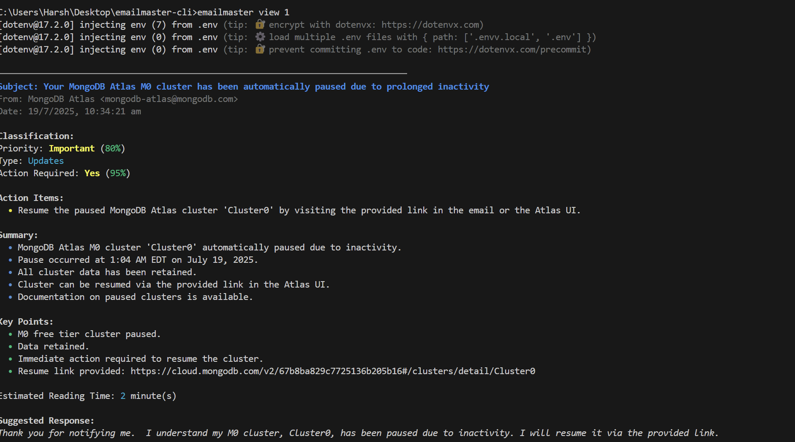

# 📧 EmailMaster CLI
**🤖 AI-Powered Gmail Management Tool**_Transform your inbox into an intelligent, organized workspace with cutting-edge AI technology_[✨ Features](#-features) • [📸 Screenshots](#-screenshots) • [🥠Videos](#-videos) • [🚀 Quick Start](#-quick-start) • [📄 License](LICENSE.md) • [â­ Star this repo](#)---
## 🯠Project OverviewEmailMaster CLI is a next-generation command-line interface that revolutionizes Gmail management through AI integration. Built with modern Node.js technologies and powered by Google's Gemini AI, it transforms the traditional email workflow into an intelligent, automated experience.**Why EmailMaster CLI?**- 🧠 **AI-First Design**: Every feature is enhanced with intelligent automation- âš¡ **Lightning Fast**: Batch processing and smart caching for optimal performance- 🨠**Beautiful Interface**: Instagram-inspired gradient designs with modern styling- 🔧 **Developer Friendly**: Comprehensive CLI with intuitive commands- 🚀 **Productivity Focused**: Achieve Inbox Zero with intelligent email categorization- 📠**Attachment Management**: Advanced file organization and bulk operations## ✨ Features<table><tr><td width="50%">### 📥 **Smart Email Management**- **Intelligent Fetching** with customizable limits- **AI-Powered Analysis** for priority classification- **Batch Processing** for optimal performance- **Multi-Account Support** with seamless switching- **Advanced Email References** with persistent identifiers### 🧠 **AI-Powered Intelligence**- **Content Analysis** with sentiment detection- **Priority Classification** (Urgent/Important/Normal)- **Suggested Responses** with contextual AI- **Natural Language Search** with semantic understanding- **Smart Summarization** with key point extraction- **Automated Response Generation**</td><td width="50%">### 🯠**Productivity Tools**- **Inbox Zero Automation** with smart sweeping- **Calendar Event Extraction** from email content- **Unsubscribe Management** with bulk operations- **Advanced Search** with natural language queries### 📠**Attachment Vault**- **Smart Download** with type and size filtering- **Automatic Organization** by date and file type- **Incremental Sync** for new attachments only- **Statistics Dashboard** with file analytics### 🨠**Modern Interface**- **Instagram-inspired** gradient color schemes- **Beautiful Tables** with modern styling- **Progress Indicators** with real-time feedback- **Responsive Design** for all terminal sizes</td></tr></table>## 📸 Screenshots
### 🨠Beautiful CLI Interface<table><tr><td width="50%" align="center"></td><td width="50%" align="center"></td></tr><tr><td align="center"></td><td align="center"></td></tr><tr><td align="center"></td><td align="center"></td></tr></table>### 🚀 Advanced Features<table><tr><td width="50%" align="center"></td><td width="50%" align="center"></td></tr><tr><td align="center"></td><td align="center"></td></tr><tr><td align="center"></td><td align="center"></td></tr></table>
## 🥠Videos
### 🬠Feature Demonstrations<table><tr><td width="33%" align="center"></td><td width="33%" align="center"></td><td width="33%" align="center"></td></tr><tr><td align="center"></td><td align="center"></td><td align="center"></td></tr></table>### ğŸ› ï¸ Advanced Tutorials<table><tr><td width="33%" align="center">_Coming Soon_</td><td width="33%" align="center">_Coming Soon_</td><td width="33%" align="center">_Coming Soon_</td></tr><tr><td align="center">_Coming Soon_</td><td align="center">_Coming Soon_</td><td align="center">_Coming Soon_</td></tr></table>
## 📋 Command Reference<table><thead><tr><th width="30%">Command</th><th width="40%">Description</th><th width="30%">Common Options</th></tr></thead><tbody><tr><td colspan="3"><strong>🔠Authentication & Account Management</strong></td></tr><tr><td><code>emailmaster accounts</code></td><td>List all configured accounts</td><td></td></tr><tr><td><code>emailmaster account-add</code></td><td>Add Gmail account with OAuth2 authentication</td><td><code>--name &lt;account&gt;</code></td></tr><tr><td><code>emailmaster account-remove</code></td><td>Remove a configured account</td><td><code>&lt;name&gt;</code></td></tr><tr><td><code>emailmaster account-switch</code></td><td>Switch between configured accounts</td><td><code>&lt;name&gt;</code></td></tr><tr><td colspan="3"><strong>📧 Core Email Operations</strong></td></tr><tr><td><code>emailmaster fetch</code></td><td>Retrieve emails from Gmail with smart caching</td><td><code>-m, --max &lt;number&gt;</code></td></tr><tr><td><code>emailmaster list</code></td><td>Show all emails with indices</td><td><code>--limit &lt;number&gt;</code></td></tr><tr><td><code>emailmaster view [identifier]</code></td><td>Display email by number</td><td><code>--id &lt;uniqueId&gt;</code></td></tr><tr><td><code>emailmaster analyze</code></td><td>AI-powered email analysis and classification</td><td><code>-n, --notify</code></td></tr><tr><td><code>emailmaster dashboard</code></td><td>Interactive inbox overview with insights</td><td></td></tr><tr><td><code>emailmaster search &lt;query&gt;</code></td><td>Search emails by query</td><td></td></tr><tr><td colspan="3"><strong>📤 Export & Productivity</strong></td></tr><tr><td><code>emailmaster export</code></td><td>Export emails to JSON/Markdown</td><td><code>--format &lt;format&gt;</code></td></tr><tr><td><code>emailmaster calendar-export</code></td><td>Extract calendar events to ICS format</td><td><code>--email &lt;number&gt; --file &lt;path&gt; --all</code></td></tr><tr><td><code>emailmaster reply &lt;email-number&gt;</code></td><td>AI-powered email replies</td><td><code>-a, --ai -s, --send -m, --manual -d, --draft --message &lt;message&gt;</code></td></tr><tr><td><code>emailmaster summary</code></td><td>Generate daily email summary report</td><td></td></tr><tr><td colspan="3"><strong>📠Attachment Management</strong></td></tr><tr><td><code>emailmaster attachments</code></td><td>View attachment commands</td><td></td></tr><tr><td><code>emailmaster attachments-fetch</code></td><td>Download all attachments</td><td><code>--days &lt;number&gt;, --output &lt;path&gt;, --types &lt;types&gt;, --max-size &lt;size&gt;, --no-organize-date, --no-organize-type</code></td></tr><tr><td><code>emailmaster attachments-sync</code></td><td>Sync new attachments incrementally</td><td><code>-o, --output &lt;path&gt; --types &lt;types&gt; --max-size &lt;size&gt;</code></td></tr><tr><td><code>emailmaster attachments-stats</code></td><td>View attachment statistics</td><td><code>-o, --output &lt;path&gt;</code></td></tr><tr><td colspan="3"><strong>🔧 Advanced Features</strong></td></tr><tr><td><code>emailmaster sweep</code></td><td>Bulk email management</td><td><code>--type &lt;type&gt;, --older-than &lt;days&gt;, --auto-archive, --dry-run</code></td></tr><tr><td><code>emailmaster unsubscribe</code></td><td>Smart unsubscribe assistant</td><td><code>--list, --send &lt;number&gt;, --all</code></td></tr><tr><td><code>emailmaster config</code></td><td>Configure EmailMaster settings</td><td><code>--batch-size &lt;number&gt; --model &lt;model&gt; --temp-dir &lt;path&gt; --show --list-models</code></td></tr><tr><td><code>emailmaster help [command]</code></td><td>Display help information</td><td></td></tr></tbody></table>#### Global Options- `--help, -h` - Show command help- `--version, -v` - Display version- `--verbose` - Detailed output- `--no-color` - Disable colored output## 🚀 Quick Start### Prerequisites<table><tr><td width="20%"><strong>Node.js</strong></td><td width="30%">v16.0.0 or higher</td><td width="50%"><a href="https://nodejs.org/">Download from nodejs.org</a></td></tr><tr><td><strong>Gmail API</strong></td><td>OAuth2 Credentials</td><td><a href="https://console.cloud.google.com/">Google Cloud Console</a></td></tr><tr><td><strong>Gemini AI</strong></td><td>API Key</td><td><a href="https://ai.google.dev/">Google AI Studio</a></td></tr></table>### ğŸ› ï¸ Installation`bash# 1. Clone the repositorygit clone https://github.com/harshendram/Email-Master---An-AI-Based-CLI.gitcd Email-Master---An-AI-Based-CLI# 2. Install dependenciesnpm install# 3. Set up environment variablescp .env.sample .env# Edit .env file with your API keys# 4. Install globally (optional)npm install -g .`### 🔑 API Setup Guide#### **Step 1: Gmail API Setup**1. Go to [Google Cloud Console](https://console.cloud.google.com/)2. Create a new project or select existing one3. Enable the **Gmail API**4. Create **OAuth 2.0 Client IDs** credentials5. Select **Desktop Application** as application type6. Download the JSON file and save as `credentials.json` in project root#### **Step 2: Gemini AI API Setup**1. Visit [Google AI Studio](https://ai.google.dev/)2. Sign in with your Google account3. Click **Get API Key** button4. Copy the generated API key5. Add to your `.env` file: `GEMINI_API_KEY=your_api_key_here`### 🯠First Run AuthorizationWhen you run your first command, EmailMaster will guide you through OAuth setup:`bash# Start with account setupemailmaster account-add --name "personal"# The CLI will:# 1. Open your browser automatically# 2. Show Google OAuth consent screen# 3. Ask for permission to access Gmail# 4. Provide an authorization code# 5. Paste the code back into CLI# 6. Display beautiful welcome message with ASCII art`## 🤠ContributingWe welcome contributions! EmailMaster CLI is built with modern development practices and AI assistance.### 🔧 Development Setup`bash# Clone the repositorygit clone https://github.com/harshendram/Email-Master---An-AI-Based-CLI.gitcd Email-Master---An-AI-Based-CLI# Install dependenciesnpm install# Set up environmentcp .env.sample .env# Add your API keys to .env# Start developingnpm run dev`### 🚀 Tech Stack- **Runtime**: Node.js 16+- **CLI Framework**: Commander.js- **AI Integration**: Google Gemini AI- **Gmail API**: OAuth2 Authentication- **Styling**: Chalk.js with custom gradients- **File System**: fs-extra for robust operations## 📄 LicenseMIT © [harshendram](https://github.com/harshendram) - Built with â¤ï¸ using modern JavaScript📜 **[Full License](LICENSE.md)** | 🔗 **[View on GitHub](https://github.com/harshendram/Email-Master---An-AI-Based-CLI/blob/main/LICENSE.md)**## 🙠Acknowledgments- 🤖 **Amazon Q Developer** - AI-powered development assistance ([See full development journey](AMAZON_Q_DEVELOPMENT.md))- 🧠 **Google Gemini AI** - Intelligent email processing and analysis- 📧 **Gmail API** - Secure email access and management foundation- 🨠**Instagram** - Color palette and design inspiration- 🔧 **Commander.js** - Powerful CLI framework and argument parsing- âš¡ **Node.js Community** - Amazing ecosystem and tools---
### â­ Star this repository if EmailMaster CLI helped boost your productivity!<table><tr><td align="center"><strong>🚀 Get Started</strong> <a href="#-quick-start">Quick Setup Guide</a></td><td align="center"><strong>📖 Commands</strong> <a href="#-command-reference">Full Reference</a></td><td align="center"><strong>📸 Screenshots</strong> <a href="#-screenshots">View Gallery</a></td><td align="center"><strong>🛠Issues</strong> <a href="https://github.com/harshendram/Email-Master---An-AI-Based-CLI/issues">Report Bug</a></td></tr></table>**Built for developers who value productivity, powered by AI that understands context**

